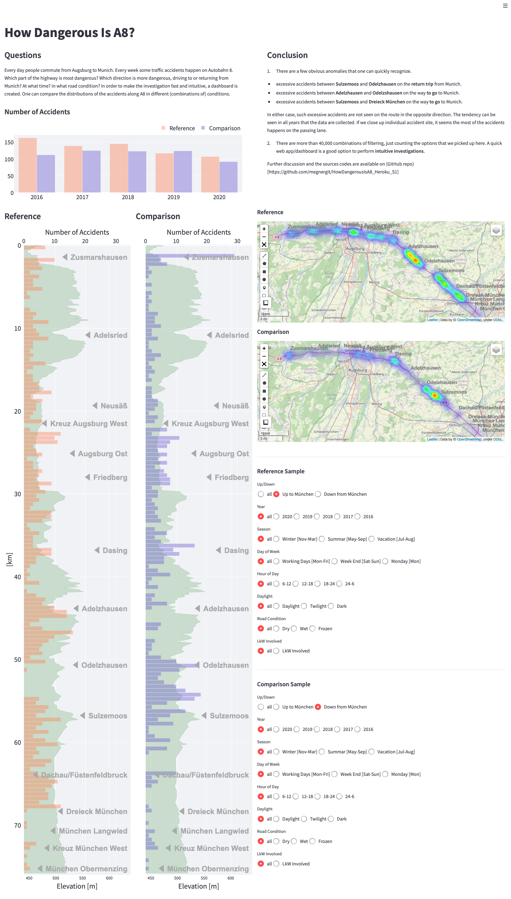

# How Dangerous Is A8

Every day people commute from Augsburg to Munich. Every week many
traffic accidents happen on Autobahn 8. Which part of the highway is
most dangerous? Which direction is more dangerous, driving to, or
coming back from Munich? At what time? In what road conditions? In
order to make the investigation fast and intuitive, a dashboard is
created. One can compare the distributions of the accidents along A8
in different (combinations of) conditions."

-----------------------------------------------------------------
## Data Source / Services Used

### Accidents Data

The data provider of the traffic accidents in Germany is
**Statistische Ämter des Bundes und der Länder**, who offers
**UnfallAtlas** on the following web site.
[UnfallAtlas](https://unfallatlas.statistikportal.de) 
[Statistische Ämter des Bundes und der Länder](https://www.statistikportal.de/de/statistische-aemter)

The direct link to the data is
[here](https://unfallatlas.statistikportal.de/_opendata2021.html).
The data only covers the accidents that involve **personal** injuries.
The accidents that caused only  the property damages are not included.

Acknowledgement: The data presented in this App is used under the
condition defined by Data license Germany – attribution – Version 2.0.
The license text is available [here](https://www.govdata.de/dl-de/by-2-0).

### Geocoding

The service provided by **photon&& through `geopandas.tool` is used
for geocoding. photon is made with **OpenStreetMap**.
[photon](https://www.govdata.de/dl-de/by-2-0)
[OpenStreetMap](https://www.openstreetmap.org)

### Reverse Geocoding

The reverse geocoding is performed using the API offered by 
**Nominatim** through `geopy.geocoders` library. Nominatim 
uses **OpenStreetMap** dataset. 
[Nominatim](https://nominatim.org/release-docs/develop/api/Overview/)
[OpenStreetMap](https://www.openstreetmap.org)

### Routing

To find out the coordinates on the tracks of A8, we used the API
service offered by **Open Source Routing Machine (OSRM)**.
(OSRM)[http://project-osrm.org]

### Locations of Autobahnanschlussstelle
...were read manually using **Google Map**.

The data sources and the services mentioned above are all offered for
free. I do greatly appreciate the teams whose efforts made this
dashboard possible.

----------------------------------------------------------------- 
## What this App Does

        1. Collect the accidents data from UnfallAtlas website in csv
           format.

        2. Clean-up the data (the collections of the data are slightly
           different each year).

        3. Get the coordinates on A8 (tracks up to, and down from
           Munich, separately) using OSRM service (see 'Data Source /
           Services Used')

        4. Calculate the distances between an accident site and the A8
           up/down tracks to identify on which track (= the direction
           of the flow on the highway) the accident happened.

        5. Use the data collected on 3., and convert the latitudes and
           the longitude of the accident sites to one dimensional
           distance, i.e., the distance from the entrance of A8 (in
           our case AS Zusmarshausen).

        6. Aggregate the data as histogram, heat map, and bar chart.

        7. Show the figures and the maps on a dashboard using
           `streamlit`.  Add controls to filter the types of accidents
           using streamlit API.

        8. Deploy the App on Heroku.

-----------------------------------------------------------------
## Screenshot

The App is currently (Dec 2021) running
[**here**](https://vast-waters-19154.herokuapp.com), but is scheduled
to stop soon. When the App is running, we should see a web page
looking like this.

---------------------------------------------------------------
## Conclusions

1. There are more than 46,000 combinations of filtering, just counting
   the options that we picked up here. A quick web app/dashboard is a
   good option to perform **intuitive investigations**."

2. It is almost impossible to try out all the combinations of
   filtering, but there are a few obvious anomalies one can recognize
   quick. 

        - Excessive accidents between **Sulzemoos** and **Odelzhausen**
          on the **return trip** from Munich.

        - Excessive accidents between **Adelzhausen** and **Odelzshausen**
          on the way **to go** to Munich.

        - Excessive accidents between **Sulzemoos** and **Dreieck
          München** on the way **to go** to Munich.

   In either cases, such excesses are not observed on the route in the
   opposite direction. The tendency can be seen in all years that the
   data are collected. If we close up individual accident site, it
   seems that the most of the accidents happens on the passing lanes.

3. To do: Currently we show the **number** of the accidents. We would
   like to show the **rate** of accidents with respect to the base
   flow of the traffic, so that we can compare on what conditions the
   traffic accidents more likely happen. In order to calculate the
   rates, however, we need the base flow of the traffic on A8, ideally
   as a function of time and place.

-----------------------------------------------------------------
## Summary of Tech Stack

| For                           | Tech used                   |
|-------------------------------|-----------------------------|
|Coding                         | Python                      |
|Geocoding                      | photon/OpenStreetMap        |
|Reverse Geocoding              | Nominatim/OpenStreetMap     |
|Routing                        | OSRM                        | 
|Visualization                  | plotly, folium              |
|Webpage/Interaction            | streamlit                   |
|Deployment                     | Heroku                      |

-----------------------------------------------------------------
# END
